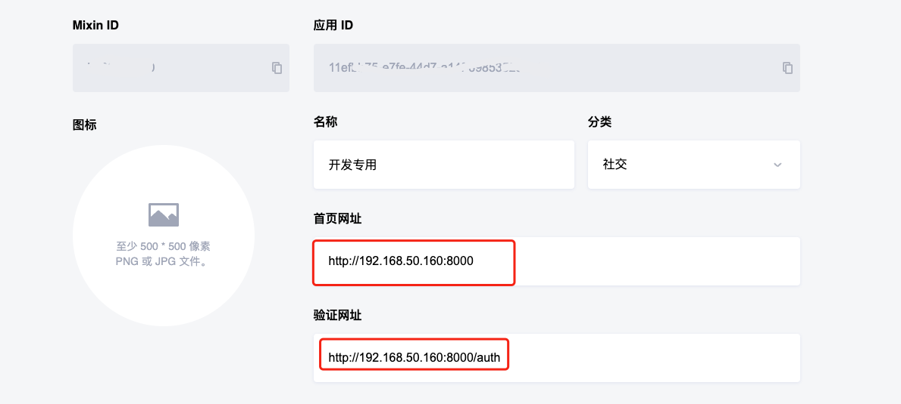

# 用户授权

### 1. 权限介绍

通过用户的授权，我们可以便捷的获取用户信息。

> 用户授权的大体逻辑为：
>
> 1. 用户点击授权按钮，开发者获取到用户授权的 `code`
> 2. 开发者将 `code` 发送到自己的服务器
> 3. 自己的服务器通过 `code` 获取用户的 `access_token` 和 `scope`，服务端详情参见 [用户授权](/docs/server/client/user#1-%E7%94%A8%E6%88%B7%E6%8E%88%E6%9D%83%E7%99%BB%E9%99%86)
> 4. 开发者使用 `access_token` 和 `scope` 获取用户的信息，客户端详情参见 [使用 Token 访问用户信息](/docs/server/userWithToken)

| 权限               | 介绍                                                  |
| :----------------- | :---------------------------------------------------- |
| PROFILE:READ       | 获取用户基本信息，如用户 ID、Mixin ID、姓名、头像等。 |
| PHONE:READ         | 获取用户的手机号码。                                  |
| ASSETS:READ        | 获取用户资产列表和余额。                              |
| CONTACTS:READ      | 获取用户联系人列表、黑名单列表。                      |
| MESSAGES:REPRESENT | 允许机器人代表用户发送消息。                          |
| SNAPSHOTS:READ     | 访问用户的转账记录，包括存款和提现。                  |
| COLLECTIBLES:READ  | 获取用户的 NFT 资产详情。                             |


### 2. 使用回调页面完成 `code` 获取

使用回调页面完成 `code` 获取的开发思路和流程：

1. 完成授权范围 `scope` 的配置
2. 完成回调页面 `params` 的配置
3. 调用 `Mixin.toAuthPage(params)`，此时会跳转到授权页面。
   整体的代码如下：
  ```js
  const scope = {
    profile: true, // PROFILE:READ
    phone: true, // PHONE:READ
    contacts: true, // CONTACTS:READ
    assets: true, // ASSET:READ
    snapshots: true, // SNAPSHOTS:READ
    messages: true, // MESSAGES:REPRESENT
    collectibles: true, // COLLECTIBLES:READ
  };

  const params = {
    scope, // 默认 profile:true
    client_id: 'uuid', // 指定授权的机器人 client_id
    return_to: '/returnTest', // 用户授权完了之后的回调页面路由()
    state: 'stateTest', // 回调页面会携带这个参数
    useCDN: false, // 是否使用 国内加速域名，默认开启
  };

  Mixin.toAuthPage(params);
  ```

4. 用户授权后，会跳转到回调页面，此时可以获取到 `code`。回调页面的配置就是下图的`验证网址`。
  

5. 如果按照上述第三步和第四步的配置，那么回调页面的 `url` 就是 `http://192.168.50.160:8000/auth?code=xxx&state=stateTest&return_to=/returnTest`，此时可以在回调页面获取到 `code` 、 `state`、 `return_to`。
6. 将 `code` 发送到自己的服务器，自己的服务器通过 `code` 获取用户的 `access_token` 和 `scope`，服务端详情参见 [用户授权](/docs/server/client/user#1-%E7%94%A8%E6%88%B7%E6%8E%88%E6%9D%83%E7%99%BB%E9%99%86)


### 3. 应用内完成授权获取 `code` 

无需跳转到授权页面，直接在当前页面完成授权。相比传统的回调页面授权的方式，

1. 用户体验要更好。
2. 开发者使用也更便捷。
3. 推荐使用。

使用静默授权的方式只有一步就可以拿到 `code`
```js
import {MixinLogin} from 'mixin-web-sdk'

async getCode(){
  const scope = {
    profile: true, // PROFILE:READ
    phone: true, // PHONE:READ
    contacts: true, // CONTACTS:READ
    assets: true, // ASSET:READ
    snapshots: true, // SNAPSHOTS:READ
    messages: true, // MESSAGES:REPRESENT
    collectibles: true, // COLLECTIBLES:READ
  };
  const { authorization_code } = await MixinLogin('use client_id replace here', scope);
}
```

可以无视回调页面的授权配置以及页面传参的 `state` 和 `return_to`。直接在当前页面拿到 `code`。
然后将 `code` 发送到自己的服务器，自己的服务器通过 `code` 获取用户的 `access_token` 和 `scope`，服务端详情参见 [用户授权](/docs/server/client/user#1-%E7%94%A8%E6%88%B7%E6%8E%88%E6%9D%83%E7%99%BB%E9%99%86)


#### 返回值
```json
{
  "code_id": "string",
  "authorization_id": "string",
  "authorization_code": "string", // 授权码，用于获取 access_token
  "scopes": "string[]", // 用户授权的范围
  "user": {...}, // 授权的用户信息
  "app": {...}, // bot 的信息。
}
```

:::tip 提示
当 `scopes.length === 0` 时，表示用户拒绝授权。此时 `authorization_code` 为空。
:::


### 4. 静默授权

此方法无需获得用户授权，不过需要用户在与 `Bot` 的会话中打开机器人首页时才有效。

思路如下：
1. 先获取 `conversation_id`，可以通过 [`Mixin.getConversationId`](/docs/web/enviroment#5-获取当前会话的-conversation_id) 方法获取。
2. 将 `conversation_id` 传给后端，后端通过 [`conversation_id` 获取到会话信息`conversation`](/docs/server/client/conversation#3-获取会话) 。
3. 如果 `conversation.category === 'CONTACT'`，则可以通过 `conversation.participants` 获取到会话中的用户信息。
4. 如果会话中的一个用户是 `Bot`，那么另外一个用户就是打开页面的用户。
5. 再根据用户的 `user_id` 就可以[获取到用户信息](/docs/server/client/user#4-根据-user_id-或-identity_number-获取单个用户信息)了。

:::danger 警告
此方法有很多风险。

比如用户可以通过修改 `conversation_id` 来伪造用户信息。

或者用户在群聊、其他单聊中打开机器人首页等。

所以不建议使用。仅提供思路。
:::